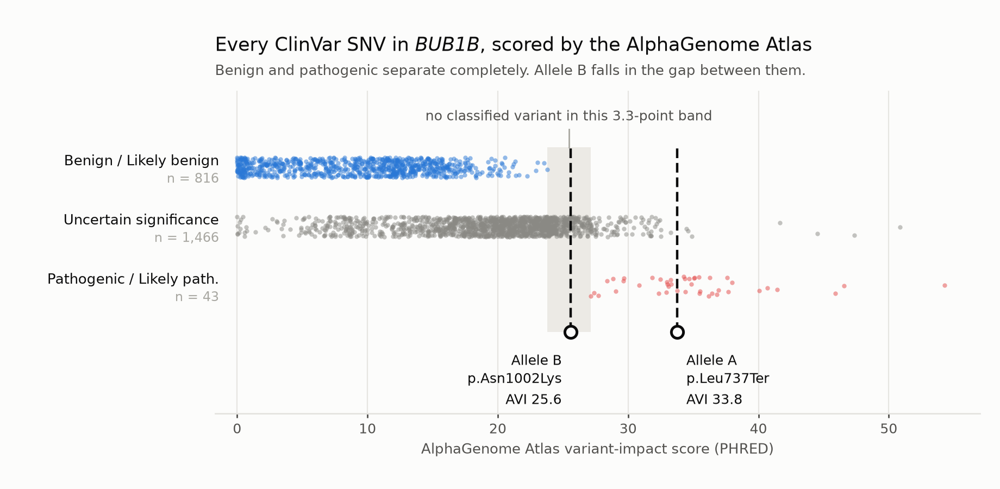
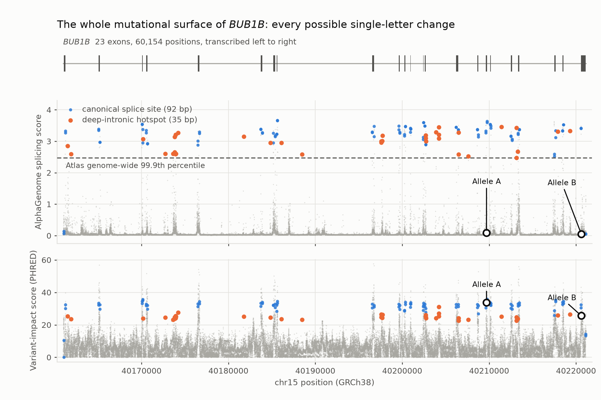

# The AlphaGenome Atlas applied to this genome

*Companion to [`track1-variant-report.md`](track1-variant-report.md). Everything here is a lookup against DeepMind's precomputed AlphaGenome Atlas, downloaded 8 September 2026 from `deepmind.google.com/science/alphagenome/downloads`. Scripts `mva/track1/10`–`17`, helper `mva/src/mva/atlas.py`.*

---

## 1. What was downloaded, and what it actually contains

Three bgzip+tabix tables, all keyed on `(CHROM, POS, REF, ALT)`:

| Artifact | Size | Licence | Contents |
|---|---|---|---|
| AVI SNV scores | 88.5 GB | commercial **and** non-commercial | one variant-impact score per possible change, raw and PHRED |
| Merged splicing scores | 20.6 GB | **non-commercial only** | one splicing-disruption score per possible change |
| AVI SHAP feature importances | 283.9 GB | **non-commercial only** | 18 per-feature contributions that sum to the AVI raw score |

**All three are SNV-only.** The feature-importance filename contains the word `indels` and the table carries `IS_INSERTION` / `IS_DELETION` columns, but no row in any of the three files has a multi-base `REF`/`ALT` or a set flag — checked across three sampled 100 kb windows on chr1, chr7 and chr15 and across the whole *BUB1B* locus. Scoring an indel needs the AlphaGenome API, which needs a key this project does not have. **Every splicing negative below is therefore an SNV negative**, and the five called indels inside *BUB1B* remain unscored by any splice model in this dossier.

## 2. The first result is against us: the headline score is not independent evidence

The AVI score is a linear ensemble, and two of its inputs — AlphaMissense and multi-species conservation — are predictors this dossier already cites on their own. The SHAP release makes the overlap measurable instead of arguable. `17_atlas_shap_audit.py` decomposes any variant's score:

| Variant | AVI PHRED | AlphaMissense | Conservation | Termination | AlphaGenome's own tracks |
|---|---|---|---|---|---|
| Allele A `p.Leu737Ter` | 33.77 | 0 % | 19 % | **77 %** | 3 % |
| Allele B `p.Asn1002Lys` | 25.61 | **60 %** | 36 % | 0 % | 4 % |
| `c.3006T>C` synonymous, ClinVar Likely benign | 16.90 | 0 % | 80 % | 0 % | 20 % |

**Allele B's AVI score is 60 % AlphaMissense by construction.** Quoting "AlphaMissense 0.923 **and** AlphaGenome 25.6" as two arguments would be the same number counted twice, and this report criticises exactly that move elsewhere. **AVI is therefore given no weight in the classification of allele B.** It is reported for transparency and because the audit itself is a finding: a scoring tool that ships its own feature attributions can be checked for double counting, and most cannot.

Allele A is the opposite case — 77 % of its score is the protein-termination flag, no AlphaMissense at all — but a stop-codon detector agreeing that a stop codon is a stop codon adds nothing either.

## 3. Does the Atlas work *in these genes*? A ClinVar benchmark

A predictor is worth citing on a novel variant only where it agrees with the answer on known ones. `12_atlas_clinvar_benchmark.py` scores every ClinVar SNV in the six MVA and spindle-checkpoint genes — 6,202 records — and asks whether Pathogenic/Likely pathogenic separates from Benign/Likely benign.

| Score | AUC, all consequences | AUC, missense only |
|---|---|---|
| AVI PHRED | 0.996 | 0.931 |
| AlphaMissense contribution alone | 0.526 | 0.876 |
| AlphaGenome splicing | 0.778 | 0.503 |

**The 0.996 is mostly tautology and should not be quoted alone.** 41 of the 70 pathogenic records are nonsense variants and the model has a protein-termination feature, so it is being congratulated for knowing that a stop codon is a stop codon. The honest number is the missense-only 0.931 on 7 pathogenic against 126 benign, and with n = 7 that is a direction, not a measurement.

The genuinely surprising row is the second one. **Across all consequence classes AlphaMissense is no better than a coin toss in these genes (AUC 0.526)**, because the pathogenic burden in *BUB1B* is truncating and a missense predictor scores truncating variants at zero. A pipeline that reached for AlphaMissense as its primary in-silico filter here would rank the nonsense alleles below the benign missense ones.

### The gap, and where allele B falls in it

Restricting to *BUB1B* — 2,382 ClinVar SNVs, 43 P/LP, 816 B/LB, 1,466 VUS — the two classified sets **do not overlap at all**:

- every Benign / Likely benign record scores **≤ 23.78**
- every Pathogenic / Likely pathogenic record scores **≥ 27.12**
- **allele B scores 25.61, inside the 3.3-point band where no classified variant sits**



That is not a failure of the tool and it is not support for the variant. It is the same verdict ACMG reaches by a different route, and it is what a **hypomorph** should look like: MVA1 requires one null and one partially functional allele, because biallelic truncating *BUB1B* is not viable. An allele B that scored with the pathogenic set would be evidence *against* the mechanism this dossier argues for. The report's classification of allele B as a VUS whose support is the genotype and the phenotype — not any score — survives this test unchanged.

## 4. The splice negative, now earned rather than assumed

Earlier drafts scoped the splice negative to "no variant within ±20 bp of an exon boundary", and flagged that SpliceAI had not been run standalone. Two Atlas results replace that.

**First, the splicing model demonstrably works in this gene.** The eight canonical-splice-site pathogenic records in *BUB1B* score 2.54–3.40 (median 3.26), and two of the three pathogenic *intronic* records score 3.04 and 2.08 — the model finds the known splice-disrupting alleles, including deep-intronic ones. Against that, allele A scores **0.087** and allele B **0.048**: 37× and 68× below the median known splice-pathogenic variant in the same gene. The negative is calibrated against positives from the same locus, not against a threshold picked in advance.

**Second, every SNV in the gene was scored, not just the two.** All nine called SNVs inside *BUB1B* have splicing scores; the seven that are not alleles A or B score 0.029–0.039, the genome-wide median.

## 5. The whole mutational surface of *BUB1B*

The Atlas has all three alternates at every position, so the gene's entire mutational surface is a lookup — 180,462 scored changes over 60,154 positions, in 1.3 seconds (`13_atlas_bub1b_map.py`).



| Region | Positions | Median max AVI | Median max splicing | Fraction ≥ 2.47 |
|---|---|---|---|---|
| Canonical splice site (±2 bp) | 92 | 32.28 | 3.2995 | **95.7 %** |
| Splice region (±3–20 bp) | 822 | 11.75 | 0.1757 | 9.6 % |
| Exonic | 3,669 | 19.73 | 0.1063 | 1.0 % |
| Intronic | 55,571 | 4.86 | 0.0336 | 0.06 % |

This answers the question MVA1 actually poses in clinic. When a patient has one *BUB1B* hit and the second allele has not been found, **where should the search go?** The Atlas names the places: **35 deep-intronic positions** where a single change would score above the Atlas's own genome-wide 99.9th percentile, and 38 exonic positions where a change would disrupt splicing rather than protein — exonic splice enhancers and silencers, which no distance rule from an exon boundary can see.

**This proband carries no variant at any of the 35, and the nearest called variant is 606 bp away.** That is a far stronger statement than the ±20 bp negative it replaces, and it is checkable: the 35 positions are listed in the working directory.

## 6. Genome-wide pass

All 3,981,890 called SNVs were annotated (`11_alphagenome_scan.py`; 25 per-contig tabix jobs in parallel, ~11 min). 82 reach the Atlas's genome-wide 99.9th splicing percentile and 79 reach AVI PHRED 30; the union is 140, of which **16 are rare** (gnomAD AF < 0.01 or absent) after VEP.

`16_atlas_secondary_findings.py` characterises those 16 from evidence rather than from a gene list transcribed from memory — a list quoted from memory is the same unaudited annotation this project keeps finding fault with. For each, it counts how many Pathogenic/Likely-pathogenic records ClinVar holds for that gene *at all*.

- **All 16 are heterozygous. No gene carries more than one.** No recessive candidate exists among them.
- **12 of the 16 are in genes with zero P/LP records in the whole of ClinVar** — not established Mendelian disease genes.
- The four genes with any pathogenic record are *ATP6V1E1* (1), *HLA-DRB1* (3), *PRPH* (4) and *BUB1B* (81). Only the last matches the phenotype, and the variant in it is allele A.
- Three of the high splicing scores are **contradicted by SpliceAI** (*PLAAT2*, *HMCN2*, *GAR1*, all SpliceAI < 0.2). Reported as a disagreement rather than resolved.

One number from this pass is worth keeping, and it argues against scores generally: **on AVI alone, allele A ranks 27th of 3.98 million calls and allele B ranks 306th.** No score threshold finds allele B. What found it was working one nominated locus exhaustively under a recessive hypothesis, which is the argument §S3 of the main report makes.

## 7. Base editing: what the sequence permits, and what it would break

Track 2 §5.1 already establishes that neither allele can be *reverted* by a base editor, because both are `T>G` and reverting needs a G→T transversion. `15_atlas_base_editing.py` confirms that and then asks a different question: **can an editor convert the stop codon into a sense codon?** That is genomic read-through rather than correction, and it is a different candidate from either the pharmacological read-through of Track 2 candidate 3 or the prime-edit reversion of candidate 6.

The patient's codon 737 is **TGA**. Two adenine-base-editor targets exist, and **both are silent on the wild-type allele**:

| Edit | Patient allele | Wild-type allele | Best guide | Bystanders in the 4–8 window |
|---|---|---|---|---|
| `chr15:40209700` A>G, − strand | TGA Ter → **CGA Arg** | TTA Leu → CTA Leu, silent | `TTCACTCTGGTAGGGACTTC` + `AG` PAM | **none** |
| `chr15:40209702` A>G, + strand | TGA Ter → **TGG Trp** | TTA Leu → TTG Leu, silent | `GTGAAGTGCCTCTGCAGAGT` + `TG` PAM | one, `40209703 A>G` = `p.Ser738Gly`, AVI 15.9 |

Three things follow, and the third is a caution.

**The guide does not need to discriminate between the alleles.** The mutation sits at protospacer position 3 in both designs — the PAM-distal, most mismatch-tolerant end — so allele-specific binding would not be achievable anyway. It is not needed, because the same edit on the functional copy is synonymous.

**The products are the same ones pharmacological read-through would give.** Track 2 records that UGA read-through inserts Trp, Cys or Arg, never Leu. The base-edited products are `p.Leu737Arg` and `p.Leu737Trp` — so the assay that gates candidate 3 also gates this one, and any functional data on those two substitutions serves both. Genomic read-through has one decisive advantage over the pharmacological version: **once the stop is gone the transcript is no longer an NMD target**, so it is not gated by experiment E6a, which asks whether any nonsense transcript survives decay at all.

**No wild-type SpCas9 guide exists for either edit.** Both need a PAM-relaxed enzyme — SpCas9-NG for the single zero-bystander guide, or SpRY, which yields five zero-bystander guides for the Arg option. PAM-relaxed variants carry higher off-target rates, which is a real cost and not a footnote.

**Limitations, stated at the same volume as the result.** The bystander analysis covers editable bases inside the editing window only; **no genome-wide off-target search was run**, and that is the analysis that would decide whether any of these guides is usable. `p.Leu737Arg` and `p.Leu737Trp` are substitutions of unknown function, and **the Atlas cannot score either** — both are two-nucleotide changes from the reference, and the Atlas holds single changes only. Delivery to the relevant tissue is as unsolved here as for candidate 6. This is a sequence-level design exercise that narrows a therapeutic option from "unspecified genomic correction" to two named edits with their bystander cost attached; it is not a proposal to edit a child.

## 8. What the Atlas did and did not add

**Added.** A standalone splice negative for every SNV in the gene, calibrated against known splice-pathogenic variants in the same gene. A conservation signal at both allele sites, independent of AlphaMissense. Confirmation that both alleles are pure coding lesions, with regulatory-track contributions near zero. Thirty-five named deep-intronic positions for the next MVA1 family with a missing second allele. Two named base-edit designs. A reusable double-counting audit.

**Not added.** Any independent support for allele B's pathogenicity — the score that looks like support is 60 % AlphaMissense. Any indel coverage. Any change to the Track 1 call, which rests where it did: on the genotype, the phenotype, and the recessive mechanism.

**Blocked.** Indel scoring, pending either an indel release on the Atlas downloads page or an AlphaGenome API key.

## 9. Reproducibility and data handling

```
mva/src/mva/atlas.py                 tabix access, SHAP decomposition, share metrics
mva/track1/10_alphagenome_atlas.py   the two alleles, all three files
mva/track1/11_alphagenome_scan.py    annotate a VCF, parallel per contig, resumable
mva/track1/12_atlas_clinvar_benchmark.py
mva/track1/13_atlas_bub1b_map.py     saturation map
mva/track1/14_atlas_figures.py       both figures
mva/track1/15_atlas_base_editing.py  guide enumeration and bystander scoring
mva/track1/16_atlas_secondary_findings.py
mva/track1/17_atlas_shap_audit.py    double-counting audit, takes any variant list
```

Set `ATLAS_DIR` to the directory holding the three unzipped tables. Everything runs against `tabix` from htslib 1.23.1.

**Only one derived table is committed** — `mva/results/texdata_alphagenome_bub1b.tsv`, the six rows covering the two disclosed alleles. Every output that carries proband genotypes (the panel scan, the genome-wide scan, the incidental-findings table, the base-editing screen) stays in the gitignored working directory with the sequence data. **The two figures mark only the two alleles already disclosed in the main report**; no other proband genotype appears in either.

AVI scores are released for commercial and non-commercial use. The splicing scores and the feature importances are non-commercial only and are used here under those terms.
